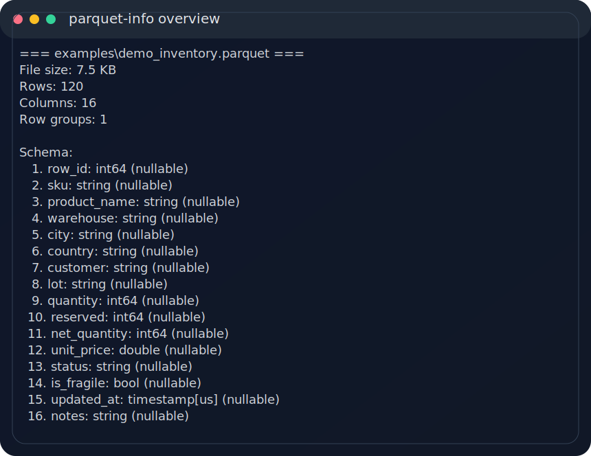
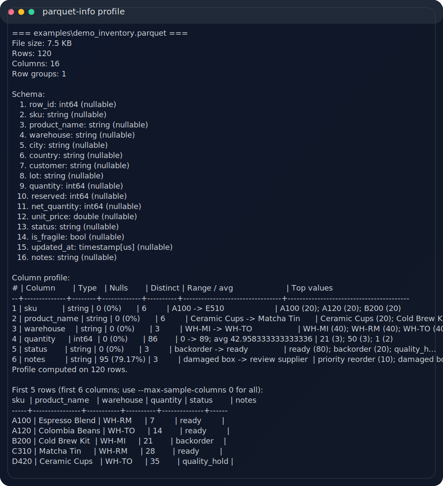
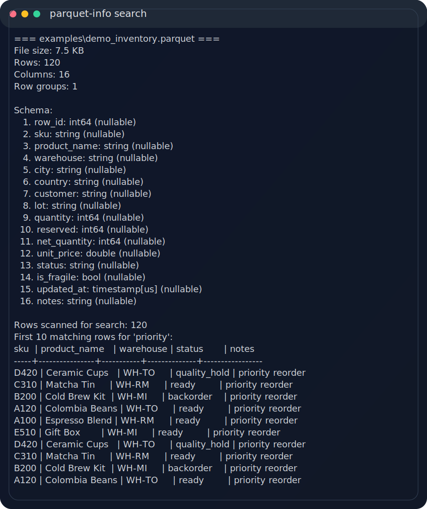
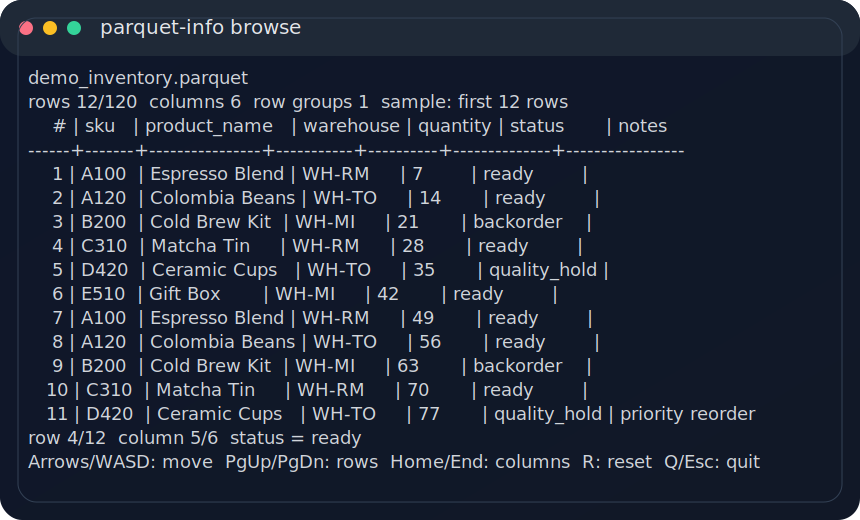

# parquet-info


Inspect Parquet files from the terminal in seconds.

`parquet_info` helps you answer the first questions you always have when a `.parquet` file lands on your machine: what is inside, how big it is, which columns matter, whether a value exists, and whether the data quality looks suspicious.

It is built for fast inspection without opening Power BI, pandas, Spark, or a notebook:

```powershell
parquet-info examples\demo_inventory.parquet --profile --search priority --format plain
```

## Why it is useful

- inspect schema and metadata immediately;
- preview rows with column limits and clipped values;
- profile columns for nulls, distinct counts, ranges, averages, and top values;
- search text across selected columns;
- export JSON for automation;
- browse rows interactively in the terminal.

## Screenshots

### Schema overview



### Column profiling



### Search results



### Interactive browser



## Install

### Install from GitHub

```powershell
python -m pip install "git+https://github.com/kessal001/parquet_info.git"
```

### Local project install

```powershell
python -m venv .venv
.\.venv\Scripts\Activate.ps1
python -m pip install -r requirements.txt
```

Run directly:

```powershell
python parquet_info.py examples\demo_inventory.parquet
```

### Install as a CLI command

```powershell
python -m pip install .
```

Then run:

```powershell
parquet-info examples\demo_inventory.parquet
```

### Windows launcher

```powershell
.\parquet_info.cmd examples\demo_inventory.parquet
```

### PyPI releases

The repo includes a Trusted Publishing release workflow. After the first PyPI release:

```powershell
python -m pip install parquet-info
```

## Quickstart

Generate the synthetic demo file used by the screenshots:

```powershell
python scripts\generate_demo_parquet.py
```

Inspect schema only:

```powershell
parquet-info examples\demo_inventory.parquet --schema-only --format plain
```

Profile selected columns:

```powershell
parquet-info examples\demo_inventory.parquet --profile --columns sku,product_name,warehouse,quantity,status,notes
```

Search for values across chosen columns:

```powershell
parquet-info examples\demo_inventory.parquet --search priority --columns sku,product_name,warehouse,status,notes
```

Export JSON:

```powershell
parquet-info examples\demo_inventory.parquet --format json --pretty-json
```

Open interactive browse mode:

```powershell
parquet-info examples\demo_inventory.parquet --browse --browse-rows 40 --columns sku,product_name,warehouse,quantity,status,notes
```

Regenerate the README screenshots after changing output formatting:

```powershell
python scripts\generate_readme_assets.py
```

## Example output

```text
=== examples\demo_inventory.parquet ===
File size: 7.5 KB
Rows: 120
Columns: 16
Row groups: 1

Schema:
   1. row_id: int64 (nullable)
   2. sku: string (nullable)
   3. product_name: string (nullable)
   4. warehouse: string (nullable)
   5. city: string (nullable)
   6. country: string (nullable)
   ...
```

## Common options

| Option | Purpose |
| --- | --- |
| `-n, --rows` | Number of sample rows to display |
| `--columns` | Comma-separated columns to preview, profile, search, or browse |
| `--max-sample-columns` | Maximum number of columns shown in the preview |
| `--max-width` | Maximum displayed width for each value |
| `--schema-only` | Skip row loading and show only metadata/schema |
| `--profile` | Enable column quality and statistics profiling |
| `--profile-rows` | Limit how many rows are used for profiling |
| `--top-values` | Number of most frequent values shown per column |
| `--search` | Search text across selected columns |
| `--search-limit` | Maximum number of matching rows to show |
| `--search-rows` | Maximum number of rows scanned during search |
| `--case-sensitive` | Make text search case-sensitive |
| `--format` | `auto`, `rich`, `plain`, or `json` |
| `--browse` | Open the interactive terminal browser |
| `--browse-rows` | Maximum number of rows loaded into browse mode |
| `--no-color` | Disable ANSI colors |
| `--version` | Print the installed CLI version |

## Performance notes

For large files, start cheap:

```powershell
parquet-info huge_export.parquet --schema-only --format plain
```

Then narrow the work:

```powershell
parquet-info huge_export.parquet --profile --profile-rows 50000 --columns customer,product_name,amount
```

If you only need a few columns:

```powershell
parquet-info huge_export.parquet -n 10 --columns customer,product_name,amount,status
```

When using `--browse`, limit the loaded sample first if the dataset is very large:

```powershell
parquet-info huge_export.parquet --browse --browse-rows 5000 --columns customer,product_name,amount,status
```

## Project structure

| Path | Purpose |
| --- | --- |
| `parquet_info.py` | Main CLI implementation |
| `parquet_info.cmd` | Windows launcher |
| `examples/demo_inventory.parquet` | Synthetic demo dataset |
| `assets/screenshots/*.svg` | README screenshots generated from CLI output |
| `scripts/generate_demo_parquet.py` | Regenerates the demo dataset |
| `scripts/generate_readme_assets.py` | Regenerates the screenshot SVGs, including browse mode |
| `tests/` | Automated CLI regression tests |
| `.github/workflows/ci.yml` | Python test matrix for pull requests |
| `.github/workflows/release.yml` | PyPI Trusted Publishing release workflow |

## Project health

- License: MIT, see [LICENSE](LICENSE).
- Contributions: see [CONTRIBUTING.md](CONTRIBUTING.md).
- Security reports: see [SECURITY.md](SECURITY.md).
- Release process: see [docs/RELEASE.md](docs/RELEASE.md).
- GitHub topics and repository settings: see [docs/GITHUB_SETUP.md](docs/GITHUB_SETUP.md).
- Roadmap: see [ROADMAP.md](ROADMAP.md).

## Contributing

Issues and pull requests are welcome, especially if you can share edge cases around:

- wide schemas;
- large row groups;
- unexpected Arrow types;
- terminal rendering quirks;
- search and profiling performance.

If `parquet_info` saves you from opening a notebook just to inspect a file, give the repo a star.
